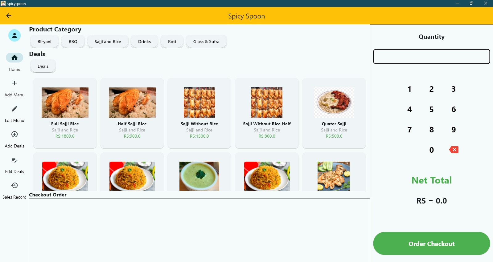
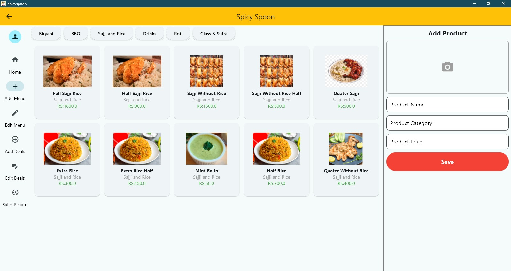
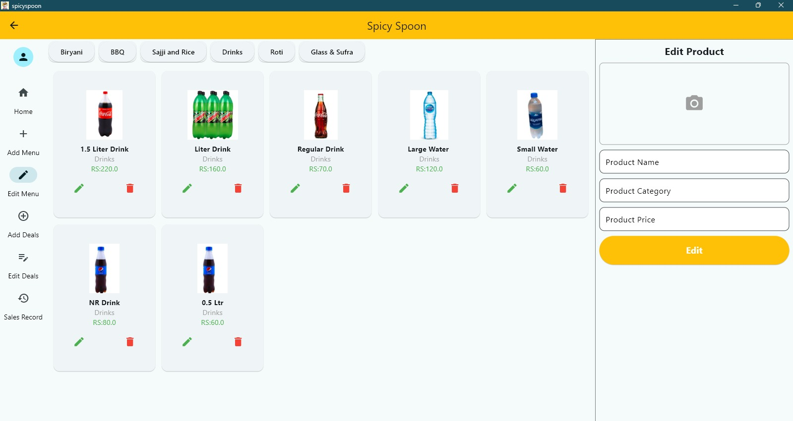
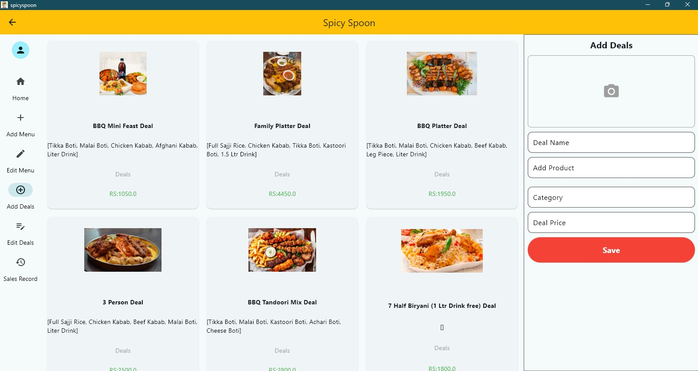
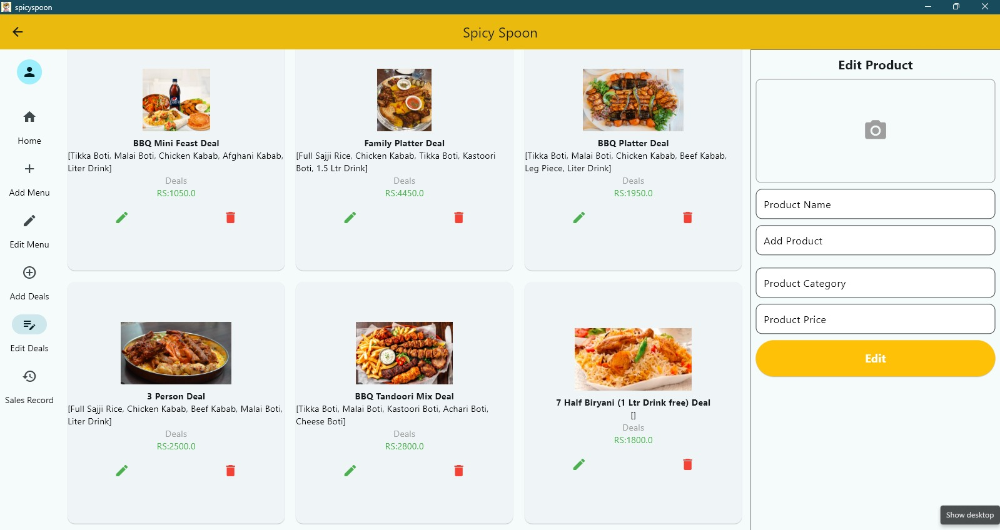
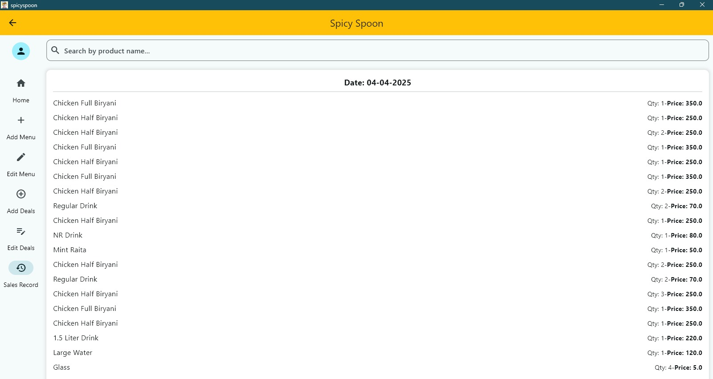

# 🍽️ Flutter Desktop POS for Restaurants

Flutter Desktop POS for Restaurants is a sleek and efficient solution tailored for seamless restaurant operations. It allows users to add, edit, and delete products and deals with ease. The system keeps a comprehensive sales record, helping staff manage transactions accurately.

To meet the need for **offline usage and speed**, it uses the **Hive local database**, ensuring fast performance without requiring internet access. Invoices are **small and compact**, designed to save thermal printer roll and reduce paper waste.

> A perfect choice for restaurants wanting a **lightweight**, **offline-friendly**, and **eco-conscious** POS system. 🧾🍽️

---

## 🔧 Features

- Add, edit, and delete products and deals
- Compact invoices for thermal printers
- Local storage using Hive DB (no internet required)
- Sales records tracking
- Fast and responsive Flutter UI

---

## 🖼️ Screenshots

| Home | Products | Add Product |
|------|----------|-------------|
|  |  |  |

| Deals | Invoice | Sales History |
|-------|---------|----------------|
|  |  |  |

---

## 🚀 Tech Stack

- **Flutter** (Desktop)
- **Hive** (Local NoSQL DB)
- **Dart**

---

## 📦 Installation

```bash
git clone https://github.com/Hizar62/Spicy-Spoon-POS.git
cd Spicy-Spoon-POS
flutter pub get
flutter run -d windows 
